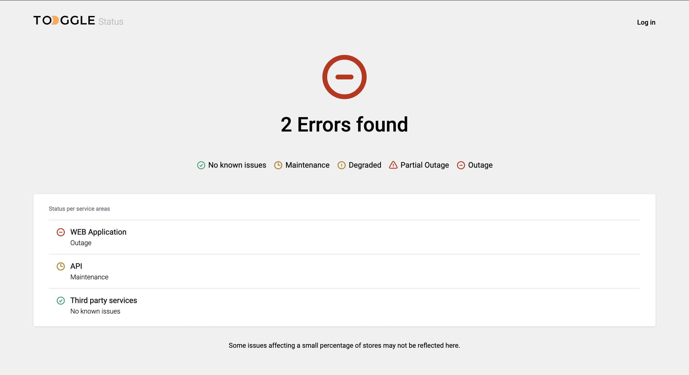

# Toggle Status Page



## Basic Overview

> Keep traking your events with offered statuses

**Features**

- Error count
- 4 types of errors (Maintenance, Degraded, Partial Outage, Outage)

## Build/Run

**Requirements**

- Node.js versions(18-21)
- Npm

```bash
# First, Install the needed packages
npm install

# Then start the React app
npm run dev
```

## Change status

1. Open App.js file
2. Change the status in 'data' array

```
[
    ...,
    {
        title: "WEB Application",
        status: statuses.AvailableStatus
    },
    ...
]
```

**Available statuses:**

- statuses.noIssues
- statuses.maintenance
- statuses.degraded
- statuses.partialOutage
- statuses.outage

## Add Recent event

1. Open App.js file
2. Add an object in 'recentEvents' array with following fields:

```
[
    ...,
     {
      title: "Title of event",
      date: "Date of event",
      status: eventStatuses.AvailableStatus,
    },
    ...
]
```

## Change Recent event status

1. Open App.js file
2. Change the status in 'recentEvents' array

```
[
    ...,
     {
      title: "Shop Pay Installments is not processing payments",
      date: "19 окт. 2023 г. at 00:40",
      status: eventStatuses.AvailableStatus,
    },
    ...
]
```

**Available Event statuses:**

- eventStatuses.resolved
- eventStatuses.onGoing
