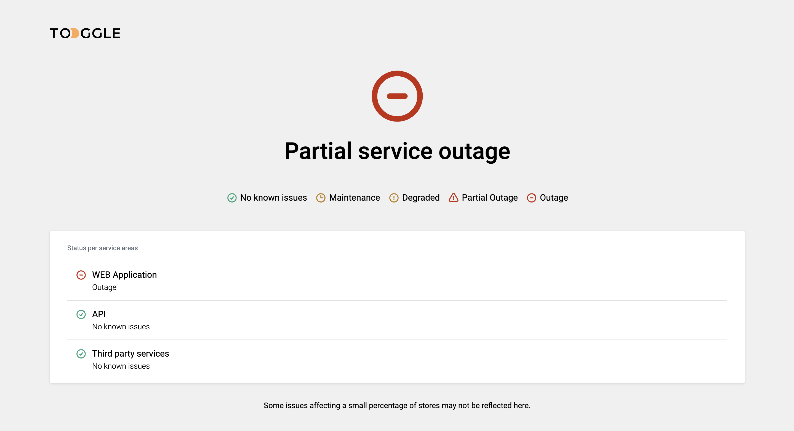

# Toggle Status Page



## Basic Overview

> Keep traking your events with offered statuses

**Features**

- Error count
- 4 types of errors

## Build/Run

**Requirements**

- Node.js versions(18-21)
- Npm

```bash
# First, Install the needed packages
npm install

# Then start the React app
npm run dev
```
